# Gnezabe Security Training Platform - System Architecture

## Architecture Overview

```mermaid
graph TB
    %% User Layer
    Users[👥 Users]
    Admins[👨‍💼 Admins]

    %% Frontend Layer
    UserFrontend[📱 User Frontend<br/>Mobile/Web App]
    AdminFrontend[🖥️ Admin Frontend<br/>React Dashboard]

    %% Backend API Layer
    subgraph "Backend API Layer"
        API[🔧 Node.js + Express.js<br/>RESTful API]
        Controllers[📋 Controllers<br/>Business Logic]
        Middlewares[🛡️ Middlewares<br/>Auth, Validation, Upload]
        Routes[🛣️ Routes<br/>API Endpoints]
    end

    %% Services/Integrations Layer
    subgraph "Services/Integrations"
        Redis[🔴 Redis<br/>Cache & Sessions]
        EmailQueue[📧 Email Queues<br/>BullMQ Jobs]
        GeezSMS[📱 GeezSMS<br/>SMS Service]
        FileStorage[💾 File Storage<br/>Images & Videos]
    end

    %% Data Storage Layer
    subgraph "Data Storage Layer"
        LocalMongo[🏠 Local MongoDB<br/>PII Data]
        CloudMongo[☁️ Cloud MongoDB<br/>Other Data]
    end

    %% Workers & Jobs
    subgraph "Background Processing"
        EmailWorker[📨 Email Worker<br/>Queue Processing]
        CleanupJobs[🧹 Cleanup Jobs<br/>Scheduled Tasks]
    end

    %% Connections
    Users --> UserFrontend
    Admins --> AdminFrontend

    UserFrontend --> API
    AdminFrontend --> API

    API --> Controllers
    Controllers --> Middlewares
    Middlewares --> Routes

    API --> Redis
    API --> EmailQueue
    API --> GeezSMS
    API --> FileStorage

    EmailQueue --> EmailWorker
    EmailWorker --> GeezSMS

    API --> LocalMongo
    API --> CloudMongo

    CleanupJobs --> LocalMongo
    CleanupJobs --> CloudMongo

    %% Styling
    classDef userLayer fill:#e1f5fe,stroke:#01579b,stroke-width:2px
    classDef frontendLayer fill:#f3e5f5,stroke:#4a148c,stroke-width:2px
    classDef backendLayer fill:#e8f5e8,stroke:#1b5e20,stroke-width:2px
    classDef serviceLayer fill:#fff3e0,stroke:#e65100,stroke-width:2px
    classDef dataLayer fill:#fce4ec,stroke:#880e4f,stroke-width:2px
    classDef workerLayer fill:#f1f8e9,stroke:#33691e,stroke-width:2px

    class Users,Admins userLayer
    class UserFrontend,AdminFrontend frontendLayer
    class API,Controllers,Middlewares,Routes backendLayer
    class Redis,EmailQueue,GeezSMS,FileStorage serviceLayer
    class LocalMongo,CloudMongo dataLayer
    class EmailWorker,CleanupJobs workerLayer
```

## Detailed Component Architecture

```mermaid
graph LR
    %% User Types
    subgraph "User Types"
        RegularUser[👤 Regular User]
        CompanyUser[🏢 Company User]
        PlatformOwner[👑 Platform Owner]
    end

    %% Authentication Flow
    subgraph "Authentication"
        AuthMiddleware[🔐 Auth Middleware]
        JWTToken[JWT Token]
        SessionMgmt[Session Management]
    end

    %% Core Modules
    subgraph "Core Modules"
        UserModule[👤 User Management]
        CompanyModule[🏢 Company Management]
        CourseModule[📚 Course Management]
        QuizModule[❓ Quiz System]
        NotificationModule[🔔 Notifications]
    end

    %% External Services
    subgraph "External Services"
        BrevoEmail[📧 Brevo Email]
        ZeroBounce[✅ ZeroBounce Validation]
        FileUpload[📁 File Upload]
        ImageProcessing[🖼️ Image Processing]
    end

    %% Data Models
    subgraph "Data Models"
        UserModel[👤 User Model]
        CompanyModel[🏢 Company Model]
        CourseModel[📚 Course Model]
        QuizModel[❓ Quiz Model]
        AuditLogModel[📋 Audit Log]
    end

    %% Database Connections
    subgraph "Database Layer"
        LocalDB[(🏠 Local MongoDB<br/>PII Data)]
        CloudDB[(☁️ Cloud MongoDB<br/>Other Data)]
    end

    %% Connections
    RegularUser --> AuthMiddleware
    CompanyUser --> AuthMiddleware
    PlatformOwner --> AuthMiddleware

    AuthMiddleware --> JWTToken
    JWTToken --> SessionMgmt

    SessionMgmt --> UserModule
    SessionMgmt --> CompanyModule
    SessionMgmt --> CourseModule
    SessionMgmt --> QuizModule
    SessionMgmt --> NotificationModule

    UserModule --> UserModel
    CompanyModule --> CompanyModel
    CourseModule --> CourseModel
    QuizModule --> QuizModel
    NotificationModule --> AuditLogModel

    UserModel --> LocalDB
    CompanyModel --> CloudDB
    CourseModel --> CloudDB
    QuizModel --> CloudDB
    AuditLogModel --> CloudDB

    UserModule --> BrevoEmail
    UserModule --> ZeroBounce
    CourseModule --> FileUpload
    FileUpload --> ImageProcessing

    %% Styling
    classDef userType fill:#e3f2fd,stroke:#1976d2,stroke-width:2px
    classDef auth fill:#fff3e0,stroke:#f57c00,stroke-width:2px
    classDef module fill:#e8f5e8,stroke:#388e3c,stroke-width:2px
    classDef service fill:#fce4ec,stroke:#c2185b,stroke-width:2px
    classDef model fill:#f3e5f5,stroke:#7b1fa2,stroke-width:2px
    classDef database fill:#e0f2f1,stroke:#00695c,stroke-width:2px

    class RegularUser,CompanyUser,PlatformOwner userType
    class AuthMiddleware,JWTToken,SessionMgmt auth
    class UserModule,CompanyModule,CourseModule,QuizModule,NotificationModule module
    class BrevoEmail,ZeroBounce,FileUpload,ImageProcessing service
    class UserModel,CompanyModel,CourseModel,QuizModel,AuditLogModel model
    class LocalDB,CloudDB database
```

## Data Flow Architecture

```mermaid
sequenceDiagram
    participant U as 👤 User
    participant F as 📱 Frontend
    participant A as 🔧 API
    participant M as 🛡️ Middleware
    participant C as 📋 Controller
    participant S as 🔴 Services
    participant D as 🗄️ Database

    U->>F: User Action
    F->>A: HTTP Request
    A->>M: Authentication
    M->>C: Validated Request
    C->>S: Business Logic
    S->>D: Data Operations
    D-->>S: Data Response
    S-->>C: Processed Data
    C-->>M: Response
    M-->>A: Formatted Response
    A-->>F: HTTP Response
    F-->>U: UI Update
```

## Security Architecture

```mermaid
graph TB
    subgraph "Security Layers"
        Helmet[🛡️ Helmet.js<br/>Security Headers]
        RateLimit[🚫 Rate Limiting]
        XSSProtection[🛡️ XSS Protection]
        MongoSanitize[🧹 MongoDB Sanitization]
        CORS[CORS Policy]
    end

    subgraph "Authentication"
        JWT[JWT Tokens]
        Bcrypt[Bcrypt Hashing]
        Session[Session Management]
    end

    subgraph "Data Protection"
        PII[PII Data<br/>Local MongoDB]
        NonPII[Non-PII Data<br/>Cloud MongoDB]
        Encryption[Data Encryption]
    end

    subgraph "Audit Trail"
        AuditLog[Audit Logging]
        UserActivity[User Activity Tracking]
        SecurityEvents[Security Events]
    end

    Helmet --> JWT
    RateLimit --> Session
    XSSProtection --> Bcrypt
    MongoSanitize --> Encryption
    CORS --> AuditLog

    JWT --> PII
    Bcrypt --> NonPII
    Session --> Encryption

    PII --> AuditLog
    NonPII --> UserActivity
    Encryption --> SecurityEvents
```

## Technology Stack

This architecture diagram represents your Gnezabe Security Training Platform with:

1. **User Layer**: Different types of users (regular users, company users, platform owners)
2. **Frontend Layer**: User and Admin frontends
3. **Backend API Layer**: Node.js + Express.js with controllers, middlewares, and routes
4. **Services/Integrations**: Redis, Email queues, GeezSMS, and file storage
5. **Data Storage Layer**: Local MongoDB for PII and Cloud MongoDB for other data
6. **Background Processing**: Email workers and cleanup jobs
7. **Security**: Multiple layers of security including authentication, authorization, and data protection

The diagram shows the complete flow from user interaction through the API layer to data storage, with proper separation of concerns and security measures in place.
