# Gnezabe Security Training Platform - Data Flow Diagram

## Complete System Data Flow

```mermaid
graph TB
    %% User Interface Layer
    subgraph "Frontend Applications"
        UserApp[📱 User Mobile/Web App]
        AdminApp[🖥️ Admin Dashboard]
        CompanyApp[🏢 Company Portal]
    end

    %% API Gateway & Middleware
    subgraph "API Gateway & Middleware"
        ExpressApp[🔧 Express.js App]
        AuthMiddleware[🔐 Authentication Middleware]
        ValidationMiddleware[✅ Validation Middleware]
        RateLimit[🚫 Rate Limiting]
        SecurityMiddleware[🛡️ Security Middleware]
        FileUpload[📁 File Upload Middleware]
    end

    %% Core Business Logic
    subgraph "Business Logic Layer"
        AuthControllers[🔐 Auth Controllers]
        UserControllers[👤 User Controllers]
        CompanyControllers[🏢 Company Controllers]
        CourseControllers[📚 Course Controllers]
        QuizControllers[❓ Quiz Controllers]
        NotificationControllers[🔔 Notification Controllers]
    end

    %% Services Layer
    subgraph "Services Layer"
        EmailService[📧 Email Service]
        NotificationService[🔔 Notification Service]
        FileService[💾 File Service]
        CacheService[🔴 Cache Service]
    end

    %% Queue & Background Processing
    subgraph "Background Processing"
        EmailQueue[📧 Email Queue<br/>BullMQ]
        EmailWorker[📨 Email Worker]
        CleanupJobs[🧹 Cleanup Jobs]
        CronJobs[⏰ Scheduled Jobs]
    end

    %% External Services
    subgraph "External Integrations"
        BrevoEmail[📧 Brevo Email API]
        GeezSMS[📱 GeezSMS API]
        ZeroBounce[✅ ZeroBounce API]
    end

    %% Data Storage
    subgraph "Data Storage Layer"
        LocalMongo[(🏠 Local MongoDB<br/>PII Data)]
        CloudMongo[(☁️ Cloud MongoDB<br/>Other Data)]
        Redis[(🔴 Redis<br/>Cache & Sessions)]
        FileStorage[💾 File Storage<br/>Images & Videos]
    end

    %% WebSocket & Real-time
    subgraph "Real-time Communication"
        SocketIO[🔌 Socket.IO Server]
        NotificationEmitter[📡 Notification Emitter]
    end

    %% Data Flow Connections
    UserApp --> ExpressApp
    AdminApp --> ExpressApp
    CompanyApp --> ExpressApp

    ExpressApp --> AuthMiddleware
    ExpressApp --> ValidationMiddleware
    ExpressApp --> RateLimit
    ExpressApp --> SecurityMiddleware
    ExpressApp --> FileUpload

    AuthMiddleware --> AuthControllers
    ValidationMiddleware --> UserControllers
    ValidationMiddleware --> CompanyControllers
    ValidationMiddleware --> CourseControllers
    ValidationMiddleware --> QuizControllers

    AuthControllers --> UserControllers
    UserControllers --> CompanyControllers
    CompanyControllers --> CourseControllers
    CourseControllers --> QuizControllers
    QuizControllers --> NotificationControllers

    UserControllers --> EmailService
    CompanyControllers --> EmailService
    CourseControllers --> FileService
    NotificationControllers --> NotificationService

    EmailService --> EmailQueue
    EmailQueue --> EmailWorker
    EmailWorker --> BrevoEmail

    NotificationService --> NotificationEmitter
    NotificationEmitter --> SocketIO

    FileUpload --> FileService
    FileService --> FileStorage

    UserControllers --> LocalMongo
    CompanyControllers --> CloudMongo
    CourseControllers --> CloudMongo
    QuizControllers --> CloudMongo
    NotificationControllers --> CloudMongo

    AuthMiddleware --> Redis
    CacheService --> Redis

    CleanupJobs --> LocalMongo
    CleanupJobs --> CloudMongo
    CronJobs --> EmailQueue

    %% Styling
    classDef frontend fill:#e3f2fd,stroke:#1976d2,stroke-width:2px
    classDef api fill:#e8f5e8,stroke:#388e3c,stroke-width:2px
    classDef business fill:#fff3e0,stroke:#f57c00,stroke-width:2px
    classDef service fill:#fce4ec,stroke:#c2185b,stroke-width:2px
    classDef queue fill:#f1f8e9,stroke:#33691e,stroke-width:2px
    classDef external fill:#e0f2f1,stroke:#00695c,stroke-width:2px
    classDef storage fill:#f3e5f5,stroke:#7b1fa2,stroke-width:2px
    classDef realtime fill:#fff8e1,stroke:#f9a825,stroke-width:2px

    class UserApp,AdminApp,CompanyApp frontend
    class ExpressApp,AuthMiddleware,ValidationMiddleware,RateLimit,SecurityMiddleware,FileUpload api
    class AuthControllers,UserControllers,CompanyControllers,CourseControllers,QuizControllers,NotificationControllers business
    class EmailService,NotificationService,FileService,CacheService service
    class EmailQueue,EmailWorker,CleanupJobs,CronJobs queue
    class BrevoEmail,GeezSMS,ZeroBounce external
    class LocalMongo,CloudMongo,Redis,FileStorage storage
    class SocketIO,NotificationEmitter realtime
```

## Authentication Flow

```mermaid
sequenceDiagram
    participant U as 👤 User
    participant F as 📱 Frontend
    participant A as 🔧 API
    participant M as 🛡️ Middleware
    participant C as 📋 Controller
    participant S as 🔴 Services
    participant Q as 📧 Queue
    participant W as 📨 Worker
    participant E as 📧 Email API
    participant D as 🗄️ Database

    U->>F: User Action (Signup/Login)
    F->>A: HTTP Request
    A->>M: Authentication Check
    M->>C: Validated Request

    alt Signup Flow
        C->>D: Create User Record
        D-->>C: User Created
        C->>S: Generate Verification Token
        S->>Q: Queue Verification Email
        Q->>W: Process Email Job
        W->>E: Send Email via Brevo
        E-->>W: Email Sent
        W-->>Q: Job Completed
        C-->>M: Success Response
        M-->>A: Response
        A-->>F: HTTP Response
        F-->>U: Success Message
    else Login Flow
        C->>D: Validate Credentials
        D-->>C: User Data
        C->>S: Generate JWT Token
        C-->>M: Success Response
        M-->>A: Response with Token
        A-->>F: HTTP Response
        F-->>U: Login Success
    end
```

## Course & Quiz Data Flow

## Notification & Real-time Updates

```mermaid
sequenceDiagram
    participant S as 🔔 System Event
    participant N as 📡 Notification Service
    participant D as 🗄️ Database
    participant Q as 📧 Email Queue
    participant W as 📨 Email Worker
    participant E as 📧 Email API
    participant S as 🔌 Socket.IO
    participant F as 📱 Frontend

    S->>N: Trigger Notification
    N->>D: Save Notification
    D-->>N: Notification Saved

    alt Email Notification
        N->>Q: Queue Email
        Q->>W: Process Email
        W->>E: Send via Brevo
        E-->>W: Email Sent
    end

    N->>S: Emit Real-time Event
    S->>F: Push to Frontend
    F-->>U: Display Notification
```

## File Upload & Processing Flow

```mermaid
sequenceDiagram
    participant U as 👤 User
    participant F as 📱 Frontend
    participant A as 🔧 API
    participant M as 📁 Upload Middleware
    participant C as 📋 Controller
    participant S as 🔴 File Service
    participant F as 💾 File Storage
    participant D as 🗄️ Database

    U->>F: Select File
    F->>A: Upload Request
    A->>M: File Validation
    M->>C: Processed File

    alt Image Upload
        C->>S: Process Image
        S->>F: Store Image
        F-->>S: Image URL
        S->>D: Save Image Metadata
        D-->>S: Metadata Saved
        S-->>C: Image Processed
        C-->>A: Success Response
        A-->>F: Upload Complete
        F-->>U: File Uploaded
    else Video Upload
        C->>S: Process Video
        S->>F: Store Video
        F-->>S: Video URL
        S->>D: Save Video Metadata
        D-->>S: Metadata Saved
        S-->>C: Video Processed
        C-->>A: Success Response
        A-->>F: Upload Complete
        F-->>U: File Uploaded
    end
```

## Background Job Processing

```mermaid
graph LR
    subgraph "Job Triggers"
        UserAction[👤 User Action]
        ScheduledTask[⏰ Scheduled Task]
        SystemEvent[🔔 System Event]
    end

    subgraph "Queue Management"
        EmailQueue[📧 Email Queue]
        NotificationQueue[🔔 Notification Queue]
        CleanupQueue[🧹 Cleanup Queue]
    end

    subgraph "Workers"
        EmailWorker[📨 Email Worker]
        NotificationWorker[🔔 Notification Worker]
        CleanupWorker[🧹 Cleanup Worker]
    end

    subgraph "External Services"
        BrevoAPI[📧 Brevo API]
        GeezSMS[📱 GeezSMS API]
        FileSystem[💾 File System]
    end

    UserAction --> EmailQueue
    ScheduledTask --> CleanupQueue
    SystemEvent --> NotificationQueue

    EmailQueue --> EmailWorker
    NotificationQueue --> NotificationWorker
    CleanupQueue --> CleanupWorker

    EmailWorker --> BrevoAPI
    NotificationWorker --> GeezSMS
    CleanupWorker --> FileSystem
```

## Database Interaction Patterns

```mermaid
graph TB
    subgraph "Data Access Layer"
        Controllers[📋 Controllers]
        Services[🔴 Services]
        Middlewares[🛡️ Middlewares]
    end

    subgraph "Database Connections"
        LocalConnection[🏠 Local MongoDB<br/>PII Data]
        CloudConnection[☁️ Cloud MongoDB<br/>Other Data]
        RedisConnection[🔴 Redis<br/>Cache & Sessions]
    end

    subgraph "Data Models"
        UserModel[👤 User Model]
        CompanyModel[🏢 Company Model]
        CourseModel[📚 Course Model]
        QuizModel[❓ Quiz Model]
        NotificationModel[🔔 Notification Model]
        SessionModel[🔐 Session Model]
    end

    Controllers --> UserModel
    Controllers --> CompanyModel
    Controllers --> CourseModel
    Controllers --> QuizModel

    Services --> NotificationModel
    Services --> SessionModel

    Middlewares --> UserModel
    Middlewares --> SessionModel

    UserModel --> LocalConnection
    CompanyModel --> CloudConnection
    CourseModel --> CloudConnection
    QuizModel --> CloudConnection
    NotificationModel --> CloudConnection
    SessionModel --> RedisConnection
```

## Security & Validation Flow

```mermaid
graph TB
    subgraph "Request Entry"
        HTTPRequest[🌐 HTTP Request]
        FileUpload[📁 File Upload]
        WebSocket[🔌 WebSocket]
    end

    subgraph "Security Layers"
        CORS[CORS Policy]
        Helmet[🛡️ Helmet.js]
        RateLimit[🚫 Rate Limiting]
        MongoSanitize[🧹 MongoDB Sanitization]
        XSSProtection[🛡️ XSS Protection]
    end

    subgraph "Authentication"
        JWTValidation[🔐 JWT Validation]
        SessionCheck[🔍 Session Check]
        RoleVerification[👑 Role Verification]
    end

    subgraph "Data Validation"
        FieldValidation[✅ Field Validation]
        TypeChecking[🔍 Type Checking]
        BusinessRules[📋 Business Rules]
    end

    HTTPRequest --> CORS
    FileUpload --> CORS
    WebSocket --> CORS

    CORS --> Helmet
    Helmet --> RateLimit
    RateLimit --> MongoSanitize
    MongoSanitize --> XSSProtection

    XSSProtection --> JWTValidation
    JWTValidation --> SessionCheck
    SessionCheck --> RoleVerification

    RoleVerification --> FieldValidation
    FieldValidation --> TypeChecking
    TypeChecking --> BusinessRules

    BusinessRules --> Controllers[📋 Controllers]
```

This comprehensive data flow diagram shows:

1. **Complete System Architecture**: From frontend to database
2. **Authentication Flow**: Detailed signup/login process
3. **Course & Quiz Flow**: How educational content is accessed and processed
4. **Notification System**: Real-time updates and email notifications
5. **File Processing**: Image and video upload workflows
6. **Background Jobs**: Queue-based processing system
7. **Database Patterns**: Data access and storage strategies
8. **Security Flow**: Multi-layered security implementation

The diagram illustrates how data flows through your system, from user interactions to data persistence, including all the middleware, services, and external integrations that make up your platform.
