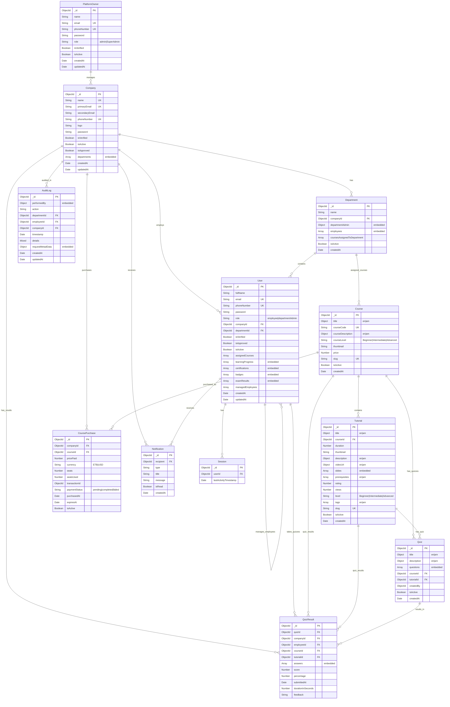

# Entity Relationship Diagram (ERD) for Gnzabe-bkbk Project

This document provides a comprehensive Entity Relationship Diagram showing all the database models and their relationships in the project.

## Database Models Overview

The project contains **12 main models** organized into different domains:

- **User Management**: PlatformOwner, Company, User, Department
- **Learning Content**: Course, Tutorial, Quiz
- **Learning Progress**: QuizResult, CoursePurchase
- **System**: Notification, AuditLog, Session

## Complete ERD Diagram

## Key Relationships Explained

### 1. **PlatformOwner → Company** (1:Many)

- Platform owners manage multiple companies
- Companies are created and approved by platform owners

### 2. **Company → Department** (1:Many)

- Each company can have multiple departments
- Departments are embedded within company documents

### 3. **Company → User** (1:Many)

- Companies employ multiple users
- Users belong to a specific company

### 4. **Department → User** (1:Many)

- Departments contain multiple employees
- Users are assigned to specific departments

### 5. **Course → Tutorial** (1:Many)

- Each course contains multiple tutorials
- Tutorials are organized within courses

### 6. **Course → Quiz** (1:Many)

- Courses can have multiple quizzes
- Quizzes are associated with specific courses and tutorials

### 7. **User → QuizResult** (1:Many)

- Users can take multiple quizzes
- Quiz results track user performance

### 8. **Company → CoursePurchase** (1:Many)

- Companies can purchase multiple courses
- Tracks licensing and seat allocation

## Database Connection Strategy

The project uses **dual database connections**:

- **Local Connection**: User, Company, PlatformOwner, AuditLog
- **Cloud Connection**: Department, Course, Tutorial, Quiz, QuizResult, CoursePurchase, Notification

## Embedded vs Referenced Documents

### Embedded Documents

- **Company.departments**: Department information embedded in company
- **User.learningProgress**: Learning progress embedded in user profile
- **User.certifications**: Certification data embedded in user
- **Quiz.questions**: Quiz questions embedded in quiz document

### Referenced Documents

- **User.companyId**: References Company.\_id
- **User.departmentId**: References Department.\_id
- **Tutorial.courseId**: References Course.\_id
- **QuizResult.quizId**: References Quiz.\_id

## Indexes and Constraints

### Unique Indexes

- Company: `name`, `primaryEmail`, `phoneNumber`
- User: `email`, `phoneNumber`
- Course: `courseCode`, `slug`
- Tutorial: `title.en`, `title.am`, `slug`
- Quiz: `title.en`, `title.am`
- PlatformOwner: `email`, `phoneNumber`

### Composite Indexes

- Department: `{companyId: 1, name: 1}` (unique within company)
- Department: `{departmentAdmin.id: 1}` (unique admin per department)

## Data Flow Patterns

1. **Company Registration**: PlatformOwner → Company → Department → User
2. **Course Management**: Course → Tutorial → Quiz
3. **Learning Progress**: User → Course → Tutorial → Quiz → QuizResult
4. **Audit Trail**: User → Action → AuditLog
5. **Notifications**: System → User/Company → Notification

This ERD represents a comprehensive Learning Management System (LMS) with multi-tenant architecture, role-based access control, and detailed tracking of user learning progress and system activities.
