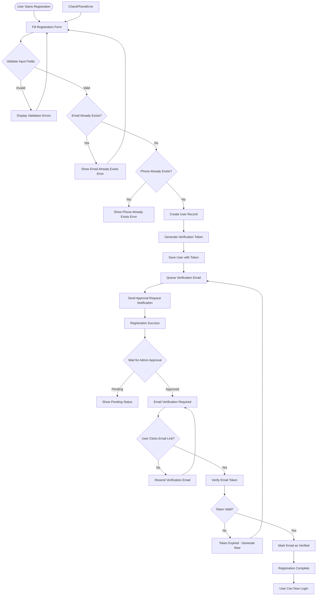
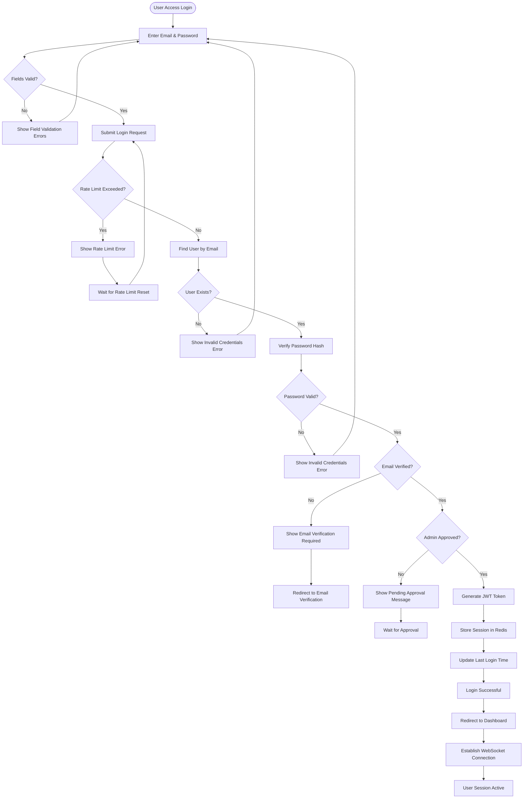
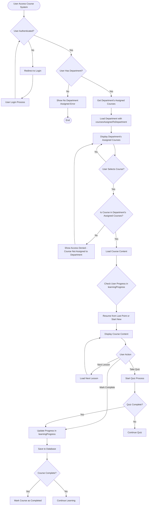
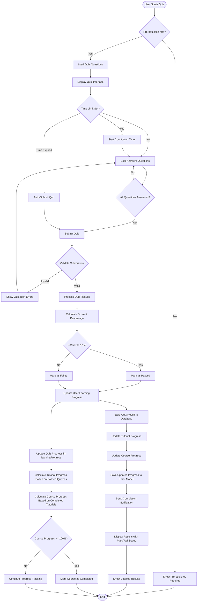
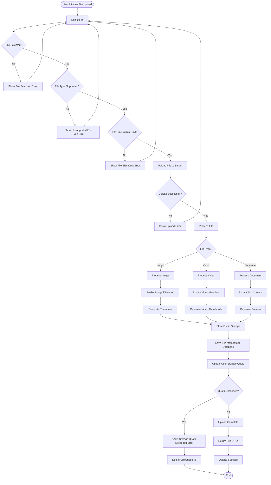
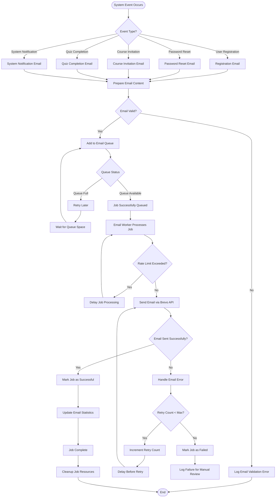
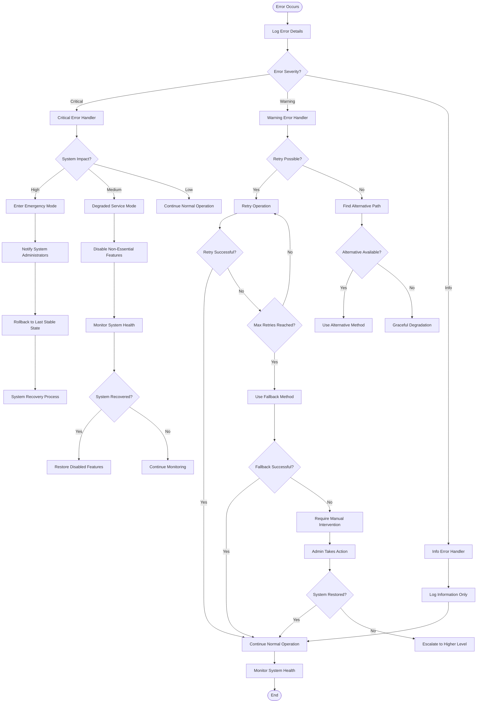
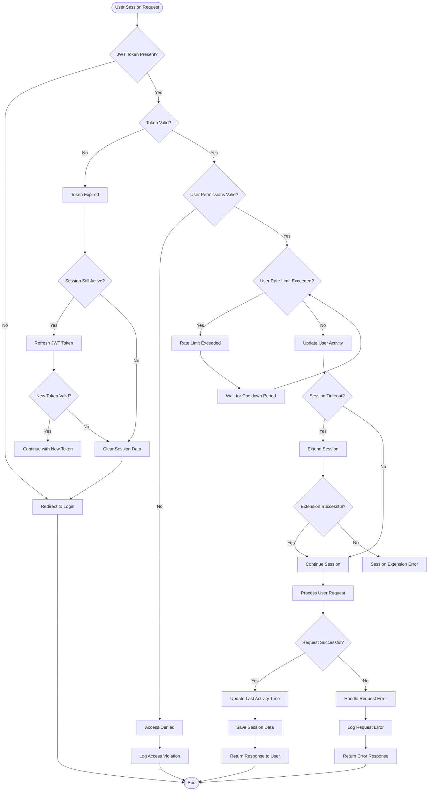
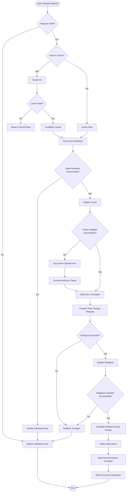
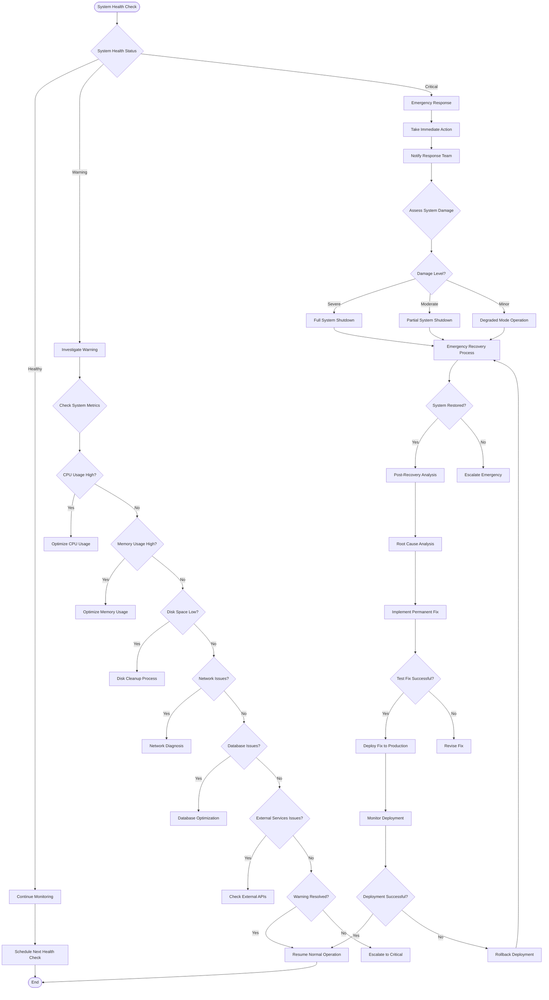

# Gnezabe Security Training Platform - Flowcharts

## 1. User Registration & Onboarding Flow

## 2. User Authentication & Login Flow

## 3. Course Access & Learning Flow (Department-Based Access)

## 4. Quiz Taking & Assessment Flow

## 5. File Upload & Processing Flow

## 6. Email Notification & Queue Processing Flow

## 7. Error Handling & Recovery Flow

## 8. User Session Management Flow

## 9. Data Synchronization & Cache Management Flow

## 10. System Health Monitoring & Maintenance Flow

## Key Features of These Flowcharts:

1. **Decision Points**: Clear branching logic for different scenarios
2. **Error Handling**: Comprehensive error handling and recovery paths
3. **Process Flow**: Step-by-step visualization of complex workflows
4. **User Experience**: Shows user interaction points and feedback
5. **System States**: Different system modes and transitions
6. **Data Flow**: How data moves through the system
7. **Security Checks**: Authentication and authorization flows
8. **Maintenance**: System health monitoring and recovery processes

## Important Notes on Course Access Implementation:

1. **No Individual Enrollment**: Users don't enroll in courses individually
2. **Department-Based Access**: Course access is controlled by `coursesAssignedToDepartment` in the Department model
3. **Automatic Access**: Users automatically get access to all courses assigned to their department
4. **Progress Tracking**: Individual progress is tracked in `learningProgress` array in User model
5. **Access Control**: The `getCourseForDepartmen` controller filters courses based on department assignment

## Important Notes on Quiz & Progress Implementation:

1. **70% Passing Threshold**: Users need to score at least 70% to pass a quiz
2. **No Certification Process**: Currently no certificate generation system exists
3. **Learning Progress Updates**: Quiz results automatically update user's learning progress
4. **Progress Calculation**:
   - Tutorial progress = (Passed quizzes / Total quizzes) × 100
   - Course progress = (Completed tutorials / Total tutorials) × 100
5. **Quiz Result Storage**: Results stored in QuizResult model with score, percentage, and pass/fail status
6. **Automatic Progress Tracking**: System automatically tracks and updates progress at quiz, tutorial, and course levels

These flowcharts now accurately reflect your actual system architecture where course access is department-based rather than enrollment-based, and quiz processing follows the 70% passing threshold with automatic learning progress updates.
