# Gnezabe Security Training Platform - Sequence Diagrams

## 1. User Registration & Email Verification Flow

```mermaid
sequenceDiagram
    participant U as 👤 User
    participant F as 📱 Frontend
    participant A as 🔧 API Gateway
    participant M as 🛡️ Middleware
    participant C as 📋 Auth Controller
    participant S as 🔴 Services
    participant Q as 📧 Email Queue
    participant W as 📨 Email Worker
    participant E as 📧 Brevo API
    participant D as 🗄️ Database
    participant N as 🔔 Notification Service

    U->>F: Fill Registration Form
    F->>A: POST /api/v1/authentication/user/signup
    A->>M: CORS, Rate Limit, Validation
    M->>C: Validated Request

    C->>D: Check Email/Phone Uniqueness
    D-->>C: Validation Result

    C->>D: Create User Record
    D-->>C: User Created

    C->>S: Generate Verification Token
    S-->>C: Token Generated

    C->>D: Save User with Token
    D-->>C: User Saved

    C->>S: Queue Verification Email
    S->>Q: Add Email Job
    Q-->>S: Job Queued

    C->>N: Send Approval Request Notification
    N->>D: Save Notification
    D-->>N: Notification Saved

    C-->>M: Success Response
    M-->>A: Response
    A-->>F: HTTP 201 Created
    F-->>U: Registration Success Message

    Note over Q,W: Background Processing
    Q->>W: Process Email Job
    W->>E: Send Email via Brevo
    E-->>W: Email Sent Successfully
    W-->>Q: Job Completed
```

## 2. User Login & Session Management

```mermaid
sequenceDiagram
    participant U as 👤 User
    participant F as 📱 Frontend
    participant A as 🔧 API Gateway
    participant M as 🛡️ Middleware
    participant C as 📋 Auth Controller
    participant S as 🔴 Services
    participant D as 🗄️ Database
    participant R as 🔴 Redis
    participant S as 🔌 Socket.IO

    U->>F: Enter Credentials
    F->>A: POST /api/v1/authentication/user/login
    A->>M: CORS, Rate Limit, Validation
    M->>C: Validated Request

    C->>D: Find User by Email
    D-->>C: User Data (with password)

    C->>S: Verify Password Hash
    S-->>C: Password Valid

    C->>S: Generate JWT Token
    S-->>C: Token Generated

    C->>R: Store Session Data
    R-->>C: Session Stored

    C->>S: Update Last Login
    S->>D: Update User Record
    D-->>S: User Updated

    C-->>M: Success Response with Token
    M-->>A: Response
    A-->>F: HTTP 200 OK + JWT Token
    F->>R: Store Token Locally
    F-->>U: Login Success + Dashboard

    Note over F,S: Real-time Connection
    F->>S: Connect WebSocket
    S-->>F: Connection Established
```

## 3. Course Access & Learning Flow

```mermaid
sequenceDiagram
    participant U as 👤 User
    participant F as 📱 Frontend
    participant A as 🔧 API Gateway
    participant M as 🛡️ Auth Middleware
    participant C as 📋 Course Controller
    participant S as 🔴 Services
    participant D as 🗄️ Database
    participant F as 💾 File Storage
    participant P as 📊 Progress Tracker

    U->>F: Browse Courses
    F->>A: GET /api/v1/courses
    A->>M: Verify JWT Token
    M->>C: Authenticated Request

    C->>D: Fetch Available Courses
    D-->>C: Course List

    C-->>M: Course Data
    M-->>A: Response
    A-->>F: HTTP 200 + Course List
    F-->>U: Display Course Catalog

    U->>F: Select Course
    F->>A: GET /api/v1/courses/:id
    A->>M: Verify JWT Token
    M->>C: Authenticated Request

    C->>D: Fetch Course Details
    D-->>C: Course Information

    C->>F: Get Course Media Files
    F-->>C: Media URLs

    C->>P: Get User Progress
    P->>D: Fetch Progress Data
    D-->>P: Progress Information
    P-->>C: User Progress

    C-->>M: Complete Course Data
    M-->>A: Response
    A-->>F: HTTP 200 + Course + Progress
    F-->>U: Display Course Content

    U->>F: Mark Lesson Complete
    F->>A: PUT /api/v1/courses/:id/progress
    A->>M: Verify JWT Token
    M->>C: Authenticated Request

    C->>P: Update Progress
    P->>D: Save Progress
    D-->>P: Progress Saved
    P-->>C: Progress Updated

    C-->>M: Success Response
    M-->>A: Response
    A-->>F: HTTP 200 + Updated Progress
    F-->>U: Progress Updated
```

## 4. Quiz Taking & Assessment Flow

```mermaid
sequenceDiagram
    participant U as 👤 User
    participant F as 📱 Frontend
    participant A as 🔧 API Gateway
    participant M as 🛡️ Auth Middleware
    participant C as 📋 Quiz Controller
    participant S as 🔴 Services
    participant D as 🗄️ Database
    participant R as 📊 Results Processor
    participant N as 🔔 Notification Service

    U->>F: Start Quiz
    F->>A: GET /api/v1/quizzes/:id
    A->>M: Verify JWT Token
    M->>C: Authenticated Request

    C->>D: Fetch Quiz Questions
    D-->>C: Quiz Data

    C-->>M: Quiz Questions
    M-->>A: Response
    A-->>F: HTTP 200 + Quiz
    F-->>U: Display Quiz Interface

    U->>F: Submit Quiz Answers
    F->>A: POST /api/v1/quiz-results
    A->>M: Verify JWT Token
    M->>C: Authenticated Request

    C->>S: Validate Quiz Submission
    S-->>C: Validation Result

    C->>R: Process Quiz Results
    R->>D: Calculate Score
    D-->>R: Score Calculated
    R-->>C: Results Processed

    C->>D: Save Quiz Results
    D-->>C: Results Saved

    C->>S: Update User Progress
    S->>D: Update Progress
    D-->>S: Progress Updated

    C->>N: Send Completion Notification
    N->>D: Save Notification
    D-->>N: Notification Saved

    C-->>M: Results Response
    M-->>A: Response
    A-->>F: HTTP 200 + Quiz Results
    F-->>U: Display Results & Certificate
```

## 5. File Upload & Media Processing

```mermaid
sequenceDiagram
    participant U as 👤 User
    participant F as 📱 Frontend
    participant A as 🔧 API Gateway
    participant M as 📁 Upload Middleware
    participant C as 📋 File Controller
    participant S as 🔴 File Service
    participant F as 💾 File Storage
    participant D as 🗄️ Database
    participant P as 🖼️ Image Processor

    U->>F: Select File (Image/Video)
    F->>A: POST /api/v1/upload
    A->>M: File Upload Middleware
    M->>M: Validate File Type & Size
    M->>C: Processed File

    C->>S: Process File
    S->>P: Process Image/Video
    P-->>S: Processed Media

    S->>F: Store File
    F-->>S: File URL

    S->>D: Save File Metadata
    D-->>S: Metadata Saved

    C->>S: Generate Thumbnails (if video)
    S->>P: Create Thumbnails
    P-->>S: Thumbnails Generated
    S->>F: Store Thumbnails
    F-->>S: Thumbnail URLs

    C-->>M: Success Response
    M-->>A: Response
    A-->>F: HTTP 200 + File URLs
    F-->>U: Upload Complete + File URLs
```

## 6. Email Notification & Queue Processing

```mermaid
sequenceDiagram
    participant S as 🔔 System Event
    participant N as 📡 Notification Service
    participant D as 🗄️ Database
    participant Q as 📧 Email Queue
    participant W as 📨 Email Worker
    participant E as 📧 Brevo API
    participant F as 📱 Frontend
    participant S as 🔌 Socket.IO

    S->>N: Trigger Email Notification
    N->>D: Save Notification Record
    D-->>N: Notification Saved

    N->>Q: Queue Email Job
    Q-->>N: Job Queued

    Note over Q,W: Background Processing
    Q->>W: Process Email Job
    W->>E: Send Email via Brevo
    E-->>W: Email Sent Successfully
    W-->>Q: Job Completed

    Note over N,S: Real-time Notification
    N->>S: Emit WebSocket Event
    S->>F: Push to Frontend
    F-->>U: Display Real-time Notification
```

## 7. Company Employee Invitation Flow

```mermaid
sequenceDiagram
    participant A as 👑 Company Admin
    participant F as 🖥️ Admin Dashboard
    participant A as 🔧 API Gateway
    participant M as 🛡️ Auth Middleware
    participant C as 📋 Company Controller
    participant S as 🔴 Services
    participant Q as 📧 Email Queue
    participant W as 📨 Email Worker
    participant E as 📧 Brevo API
    participant D as 🗄️ Database

    A->>F: Invite Employee
    F->>A: POST /api/v1/companies/invite-employees
    A->>M: Verify Admin Role
    M->>C: Authenticated Request

    C->>S: Generate Invitation Link
    S-->>C: Invitation URL

    C->>D: Create Pending Employee Record
    D-->>C: Record Created

    C->>S: Queue Invitation Email
    S->>Q: Add Email Job
    Q-->>S: Job Queued

    C-->>M: Success Response
    M-->>A: Response
    A-->>F: HTTP 200 + Invitation Sent
    F-->>A: Invitation Confirmation

    Note over Q,W: Background Processing
    Q->>W: Process Email Job
    W->>E: Send Invitation via Brevo
    E-->>W: Email Sent Successfully
    W-->>Q: Job Completed
```

## 8. User Profile Update & Data Synchronization

```mermaid
sequenceDiagram
    participant U as 👤 User
    participant F as 📱 Frontend
    participant A as 🔧 API Gateway
    participant M as 🛡️ Auth Middleware
    participant C as 📋 User Controller
    participant S as 🔴 Services
    participant D as 🗄️ Database
    participant R as 🔴 Redis
    participant N as 🔔 Notification Service

    U->>F: Update Profile Information
    F->>A: PUT /api/v1/users/profile
    A->>M: Verify JWT Token
    M->>C: Authenticated Request

    C->>S: Validate Update Data
    S-->>C: Validation Result

    C->>D: Update User Record
    D-->>C: User Updated

    C->>R: Update Cache
    R-->>C: Cache Updated

    C->>N: Send Profile Update Notification
    N->>D: Save Notification
    D-->>N: Notification Saved

    C-->>M: Success Response
    M-->>A: Response
    A-->>F: HTTP 200 + Updated Profile
    F-->>U: Profile Updated Successfully

    Note over N,S: Real-time Update
    N->>S: Emit WebSocket Event
    S->>F: Push to Frontend
    F-->>U: Real-time Confirmation
```

## 9. System Cleanup & Maintenance Jobs

```mermaid
sequenceDiagram
    participant C as ⏰ Cron Scheduler
    participant J as 🧹 Cleanup Jobs
    participant D as 🗄️ Database
    participant F as 💾 File Storage
    participant R as 🔴 Redis
    participant L as 📋 Audit Logger

    C->>J: Trigger Scheduled Cleanup
    J->>D: Find Expired Data
    D-->>J: Expired Records

    J->>D: Delete Expired Records
    D-->>J: Records Deleted

    J->>F: Clean Orphaned Files
    F-->>J: Files Cleaned

    J->>R: Clean Expired Cache
    R-->>J: Cache Cleaned

    J->>L: Log Cleanup Actions
    L->>D: Save Audit Log
    D-->>L: Log Saved

    J-->>C: Cleanup Completed
```

## 10. Error Handling & Recovery Flow

```mermaid
sequenceDiagram
    participant U as 👤 User
    participant F as 📱 Frontend
    participant A as 🔧 API Gateway
    participant M as 🛡️ Middleware
    participant C as 📋 Controller
    participant E as 🚨 Error Handler
    participant S as 📧 Sentry
    participant L as 📋 Logger

    U->>F: Perform Action
    F->>A: API Request
    A->>M: Process Request
    M->>C: Execute Controller

    alt Success Path
        C-->>M: Success Response
        M-->>A: Response
        A-->>F: Success
        F-->>U: Success Message
    else Error Path
        C->>E: Error Occurred
        E->>L: Log Error
        L-->>E: Error Logged

        E->>S: Send to Sentry
        S-->>E: Error Tracked

        E-->>M: Error Response
        M-->>A: Error Response
        A-->>F: HTTP Error Status
        F-->>U: Error Message

        Note over E: Recovery Attempt
        E->>C: Retry Logic (if applicable)
        C-->>E: Retry Result
    end
```

## Key Features of These Sequence Diagrams:

1. **Complete User Journeys**: From registration to course completion
2. **Authentication Flow**: JWT token validation and session management
3. **File Processing**: Image/video upload and processing workflows
4. **Background Jobs**: Queue-based email processing and cleanup
5. **Real-time Updates**: WebSocket notifications and live updates
6. **Error Handling**: Comprehensive error handling and recovery
7. **Data Flow**: Clear visualization of data movement through the system
8. **External Integrations**: Email services, file storage, and APIs

These sequence diagrams provide a detailed view of how different components interact in your system, making it easier to understand the flow of data and identify potential bottlenecks or areas for optimization.

